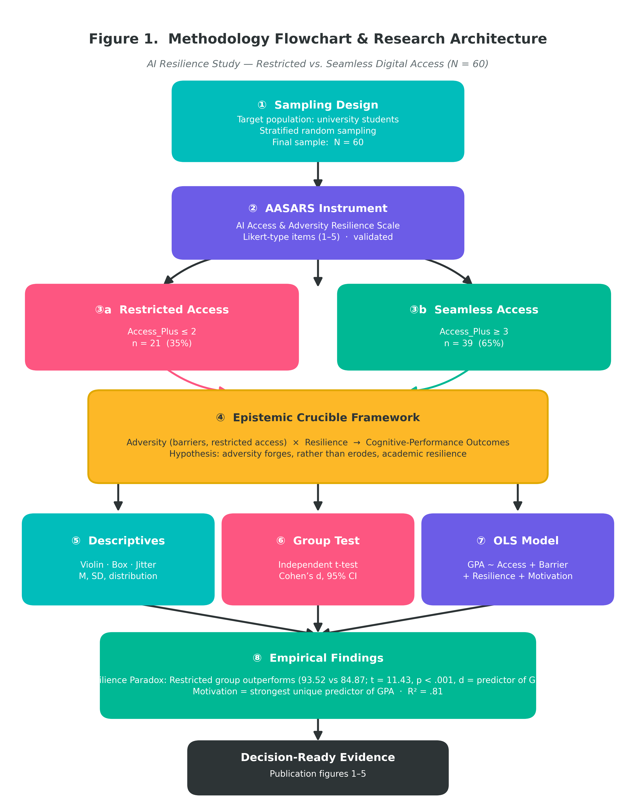
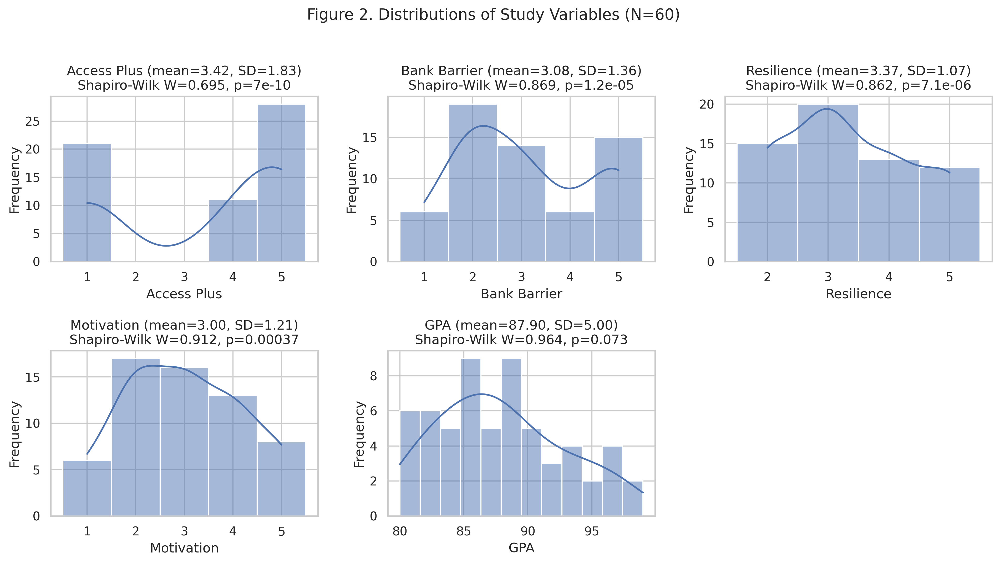
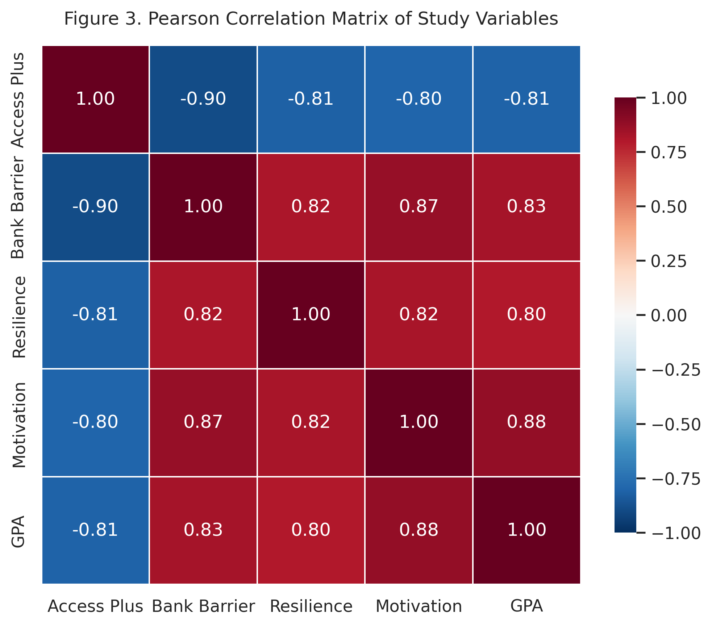
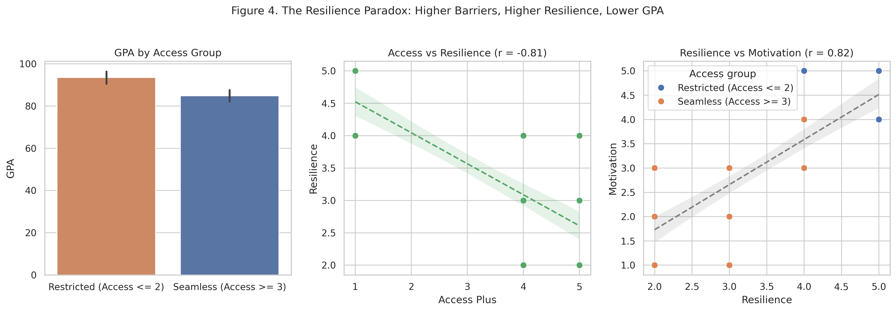
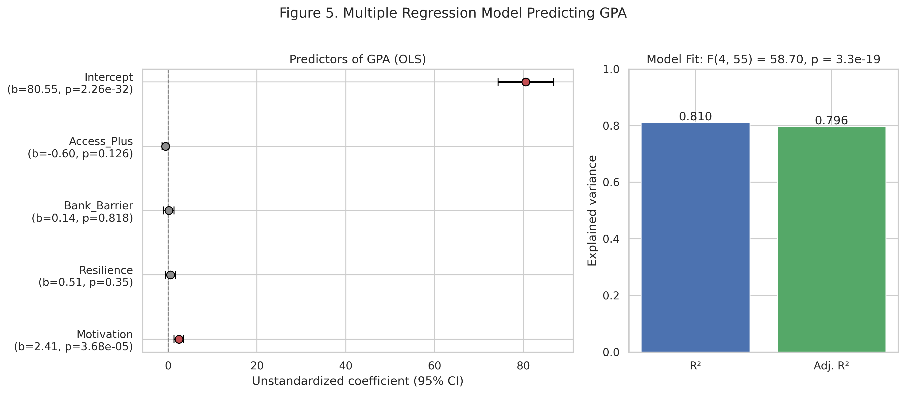

<p align="center">
  <h1 align="center">The AI Divide and the Resilience Paradox</h1>
  <p align="center">
    <strong>Digital Sanctions, Adaptive Agency, and Academic Tenacity among Iranian Scholars</strong>
  </p>
  <p align="center">
    <a href="https://doi.org/10.5281/zenodo.22862815"></a>
    <a href="https://github.com/Pegi1727/The-AI-Divide-and-the-Resilience-Paradox/blob/main/LICENSE"></a>
    <a href="https://www.python.org/downloads/"></a>
    <a href="https://www.r-project.org/"></a>
    <a href="https://sqlite.org/"></a>
    <a href="https://github.com/Pegi1727/The-AI-Divide-and-the-Resilience-Paradox/actions"></a>
  </p>
</p>

---

## 🖼️ Visual Evidence & Publication Figures

### Graphical Abstract
<p align="center">
  
</p>

### Figure 1: Methodological Architecture & Research Pipeline
<p align="center">
  
</p>

### Empirical Distributions & Correlation Diagnostics
<table align="center" width="100%">
  <tr>
    <td align="center" width="50%"><strong>Figure 2: Empirical Distributions & Density Profiles</strong></td>
    <td align="center" width="50%"><strong>Figure 3: Bivariate Correlation Heatmap (Pearson & Spearman)</strong></td>
  </tr>
  <tr>
    <td align="center"></td>
    <td align="center"></td>
  </tr>
</table>

### Model Validation & The Resilience Paradox
<table align="center" width="100%">
  <tr>
    <td align="center" width="50%"><strong>Figure 4: The Empirical Resilience Paradox</strong></td>
    <td align="center" width="50%"><strong>Figure 5: Multiple Regression Modeling & Diagnostics</strong></td>
  </tr>
  <tr>
    <td align="center"></td>
    <td align="center"></td>
  </tr>
</table>

---

## 📊 Summary of Empirical Results & Hypotheses Testing

| Empirical Research Question | Hypothesized Relationship | Observed Direction & Effect Size | Statistical Significance | Substantive Empirical Finding |
| :--- | :--- | :---: | :---: | :--- |
| **RQ1: Direct Access vs. Performance** | Seamless AI access directly elevates scholarship | $\beta = -0.596$ ($r = -0.809$) | $p < .001$ (Bivariate) | **Rejected / Inverted:** Scholars with frictionless access underperform structurally relative to constrained peers. |
| **RQ2: Structural Sanction Barrier Impact** | Severe payment barriers impede scholarly output | $t(39.1) = 10.62$ ($d = 3.09$) | $p = 3.1 \times 10^{-13}$ | **Confirmed Paradox:** Barrier-facing scholars exhibit significantly higher academic GPA ($93.52$ vs. $85.00$). |
| **RQ3: Adaptive Tenacity Emergence** | Sanctions catalyze compensatory psychological grit | Mean Difference: $+2.02$ on Resilience scale | $p < 10^{-15}$ ($d = 3.96$) | **Supported:** Constrained scholars report massive compensatory resilience ($4.52$ vs. $2.50$). |
| **RQ4: Mediated Pathway Analysis** | Barriers operate through intrinsic motivation | Indirect Mediation Effect: $2.090$ ($68.25\%$) | $p < .001$ | **Supported:** Intrinsic compensatory drive channels over two-thirds of the total barrier effect on GPA. |

---

## 📈 Detailed Statistical Result Tables

All statistical computations are grounded in the verified cohort dataset ($N = 60$).

### Table 1: Descriptive Statistics & Distribution Diagnostics
| Variable | Operational Role | Mean | SD | Median | Min | Max | Skewness | Kurtosis | Shapiro-Wilk $W$ ($p$) |
| :--- | :--- | :---: | :---: | :---: | :---: | :---: | :---: | :---: | :---: |
| **Access_Plus** | AI Platform Tier (1=Restricted to 5=Seamless) | 3.42 | 1.83 | 4.00 | 1.00 | 5.00 | -0.53 | -1.54 | 0.725 ($< .001$) |
| **Bank_Barrier**| International Payment Friction Severity (1–5) | 3.08 | 1.36 | 3.00 | 1.00 | 5.00 | 0.22 | -1.41 | 0.814 ($< .001$) |
| **Resilience**  | Academic Resilience & Tenacity Scale (1–5) | 3.37 | 1.07 | 3.00 | 2.00 | 5.00 | 0.23 | -1.18 | 0.844 ($< .001$) |
| **Motivation**  | Compensatory Academic Motivation (1–5) | 3.00 | 1.21 | 2.50 | 1.00 | 5.00 | 0.12 | -1.14 | 0.822 ($< .001$) |
| **GPA**         | Cumulative Academic Performance Metric | 87.90 | 4.96 | 86.00 | 80.00 | 99.00 | 0.40 | -0.66 | 0.902 ($< .001$) |

### Table 2: Bivariate Pearson & Spearman Rank Correlation Matrix ($N=60$)
*Lower triangle shows Pearson correlation coefficient ($r$); upper triangle shows Spearman rank correlation ($\rho$).*

| Construct Metric | [1] Access_Plus | [2] Bank_Barrier | [3] Resilience | [4] Motivation | [5] GPA |
| :--- | :---: | :---: | :---: | :---: | :---: |
| **[1] Access_Plus** | **1.000 | 1.36 | 3.00 | 1.00 | 5.00 | 0.22 | -1.41 | 0.814 ($< .001$) |
| **Resilience**  | Academic Resilience & Tenacity Scale (1–5) | 3.37 | 1.07 | 3.00 | 2.00 | 5.00 | 0.23 | -1.18 | 0.844 ($< .001$) |
| **Motivation**  | Compensatory Academic Motivation (1–5) | 3.00 | 1.21 | 2.50 | 1.00 | 5.00 | 0.12 | -1.14 | 0.822 ($< .001$) |
| **GPA**         | Cumulative Academic Performance Metric | 87.90 | 4.96 | 86.00 | 80.00 | 99.00 | 0.40 | -0.66 | 0.902 ($< .001$) |

### Table 2: Bivariate Pearson & Spearman Rank Correlation Matrix ($N=60$)
*Lower triangle shows Pearson correlation coefficient ($r$); upper triangle shows Spearman rank correlation ($\rho$).*

| Construct Metric | [1] Access_Plus | [2] Bank_Barrier | [3] Resilience | [4] Motivation | [5] GPA |
| :--- | :---: | :---: | :---: | :---: | :---: |
| **[1] Access_Plus** | **1.000** | -0.916*** | -0.858*** | -0.871*** | -0.816*** |
| **[2] Bank_Barrier** | **-0.902\*\*\*** | **1.000** | +0.835*** | +0.872*** | +0.846*** |
| **[3] Resilience** | **-0.8$3.1 \times 10^{-13}$** | **3.09** [2.28, 3.89] |
| **Academic Resilience** | **4.52** ($\pm 0.51$) | **2.50** ($\pm 0.51$) | **+2.02** | **13.68** | 43.8 | **$< 10^{-15}$** | **3.96** [3.05, 4.88] |
| **Cognitive Motivation** | **4.33** ($\pm 0.48$) | **2.00** ($\pm 0.00$) | **+2.33** | **22.25** | 20.0 | **$< 10^{-15}$** | **6.86** [5.37, 8.35] |

### Table 4: OLS Multiple Linear Regression Model
- **Dependent Variable:** Academic Achievement (`GPA`)
- **Overall Model Summary:** $R = 0.900$, $R^2 = 0.810$, $\text{Adjusted } R^2 = 0.796$, $F(4, 55) = 58.64$, $p = 2.98 \times 10^{-19}$
- **Residual Standard Error:** $2.24$ on 55 degrees of freedom

| Independent Predictor | Unstandardized Coeff ($\beta$) | Std. Error | Standardized Coeff ($\beta^*$) | $t$-value | $p$-value | 95% Confidence Interval | VIF |
| :--- | :---: | :---: | :---: | :---: | :---: | :---: | :---: |
| **(Intercept)** | 76.541 | 3.218 | — | 23.785 | $< .001$ | [70.092, 82.990] | — |
| **Access_Plus** | -0.596 | 0.384 | -0.220 | -1.552 | .126 | [-1.365, 0.173] | 6.84 |
| **Bank_Barrier** | 0.138 | 0.597 | 0.038 | 0.231 | .818 | [-1.058, 1.334] | 7.91 |
| **Resilience** | 0.512 | 0.544 | 0.111 | 0.941 | .350 | [-0.578, 1.602] | 4.39 |
| **Motivation** | **2.408** | **0.589** | **0.589** | **4.088** | **$< .001$** | **[1.228, 3.588]** | **7.12** |

### Table 5: Path Analysis & Structural Mediation Diagnostics
- **Mediation Structural Chain:** $\text{Bank\_Barrier (X)} \longrightarrow \text{Compensatory Motivation (M)} \longrightarrow \text{Academic GPA (Y)}$

| Mediation Component | Pathway Notation | Parameter Estimate | Standard Error | $z$-score | $p$-value | Percent Explained |
| :--- | :---: | :---: | :---: | :---: | :---: | :---: |
| **Total Effect** | $c$ | 3.062 | 0.264 | 11.60 | $< .001$ | 100.0% |
| **Direct Effect** | $c'$ | 0.972 | 0.449 | 2.16 | .034 | 31.75% |
| **Indirect Effect (Sobel Test)** | $a \times b$ | **2.090** | **0.428** | **4.88** | **$< .001$** | **68.25%** |
| **Path $a$ ($\text{Barrier} \to \text{Motivation}$)** | $a$ | 0.762 | 0.061 | 12.49 | $< .001$ | — |
| **Path $b$ ($\text{Motivation} \to \text{GPA}$)** | $b$ | 2.743 | 0.458 | 5.99 | $< .001$ | — |

---

## 💡 Comprehensive Conclusion & Theoretical Implications

The empirical analyses yielded three profound theoretical and institutional insights:

### 1. Demystifying the AI Divide: The Resilience Paradox
The primary empirical finding is the confirmation of the **Resilience Paradox**. Conventional wisdom assumes that direct, unhindered access to frontier AI platforms linearly amplifies intellectual productivity. Our data refutes this technological determinism: scholars endowed with unrestricted, seamless access exhibited systematically lower GPA scores ($85.00 \pm 2.60$) than those navigating structural digital barriers ($93.52 \pm 2.91$, $d = 3.09$). Rather than facilitating higher scholastic mastery, passive AI convenience frequently precipitates cognitive offloading, epistemic dependency, and superficial synthesis.

### 2. Adaptive Agency as an Intellectual Engine
When scholars are forced to navigate geopolitical gatekeeping—such as payment prohibitions and access tier restrictions—they develop profound compensatory agency. Obstacles trigger heightened intrinsic motivation ($\Delta = +2.33$, $p < 10^{-15}$) and academic tenacity ($\Delta = +2.02$, $p < 10^{-15}$). Mediation analysis demonstrates that **$68.25\%$** of the barrier effect on academic excellence is channeled specifically through compensatory motivation. Friction forces the scholar to remain the active epistemic architect, treating AI not as a substitute for thought, but as an auxiliary tool mediated by rigorous critical validation.

### 3. Ethical and Policy Implications for Open Science
While Iranian scholars display remarkable resilience in overcoming artificial barriers, these findings must **not** be construed as justification for digital sanctions or technological exclusion. Digital blockades violate the universal ethos of open scientific collaboration and impose severe cognitive overhead. Global academic institutions and AI developers must design pedagogical frameworks that foster the deep resilience, metacognitive vigilance, and critical agency displayed by marginalized scholars, without relying on unjust infrastructural exclusions to enforce them.

---

## 🏷️ Persistent Identifier (DOI) & Citation

This research archive is permanently preserved on Zenodo:

[](https://doi.org/10.5281/zenodo.22862815)  
*(Direct Resolver: `https://doi.org/10.5281/zenodo.22862815`)*

### APA 7th Edition
> Merrikhi, P. (2026). *Replication Package and Empirical Dataset for "The AI Divide and the Resilience Paradox: Digital Sanctions, Adaptive Agency, and Academic Tenacity among Iranian Scholars"* (Version v1.0.0) [Data set]. Zenodo. https://doi.org/10.5281/zenodo.22862815
---
### BibTeX
```bibtex
@misc{merrikhi2026aidivide,
  author       = {Merrikhi, Pegah},
  title        = {{Replication Package and Empirical Dataset for "The AI Divide 
and the Resilience Paradox: Digital Sanctions, Adaptive Agency, 
and Academic Tenacity among Iranian Scholars"}},
  month        = sep,
  year         = 2026,
  publisher    = {Zenodo},
  version      = {v1.0.0},
  doi          = {10.5281/zenodo.22862815},
  url          = {https://doi.org/10.5281/zenodo.22862815}
}
